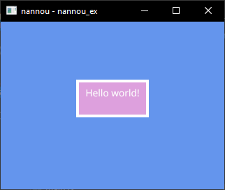

# nannou-basic-example

A basic example of `nannou`, a framework for creative coding in Rust.

This repo includes:
- the most basic incremental build
- build (release) script for WSL
- run script for Windows

## Preview

